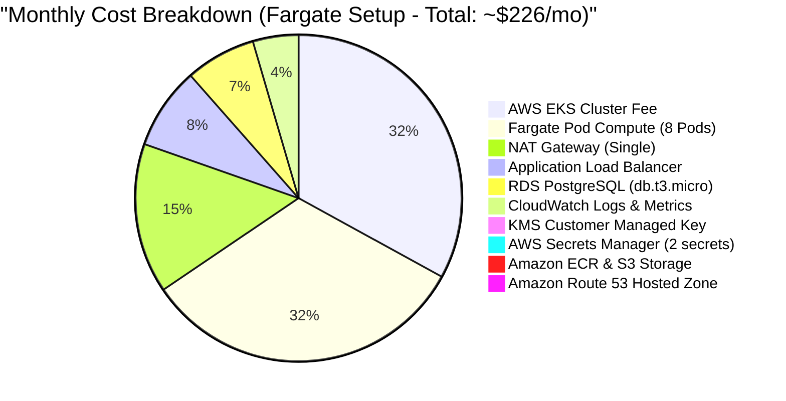

# 💰 CloudMart AWS Cost Analysis

This document provides a detailed breakdown of the estimated monthly AWS expenditure for running the **CloudMart** platform, comparing the default serverless **EKS Fargate** deployment against the alternative **EC2 Managed Node Groups** model.

---

## 📊 1. Monthly Cost Distribution (Fargate Deployment)

The default configuration provisions EKS Fargate serverless profiles for microservices compute, using a single NAT Gateway and a Single-AZ RDS PostgreSQL database instance.

---

## 💵 2. Detailed Cost Matrices

Below is the side-by-side comparison of estimated costs for both deployment configurations. All estimates are based on the **ap-south-1 (Mumbai)** region.

### Option A: Serverless Compute with EKS Fargate (Default Config)
Fargate runs containers on demand, billing per second for exact CPU and memory allocation. It is ideal for dev/staging and varying traffic.

| Service | Configuration details | Monthly Cost (USD) |
| :--- | :--- | :--- |
| **Amazon EKS Cluster** | EKS Control Plane base fee (flat charge) | **$73.00** |
| **EKS Fargate Compute** | ~8 active pods (microservices + CoreDNS + ALBC) at 0.25 vCPU & 0.5 GB RAM | **$72.00** |
| **Amazon RDS PostgreSQL** | 1x `db.t3.micro` Single-AZ instance + 20 GB gp3 storage | **$15.44** |
| **Amazon DynamoDB** | `PAY_PER_REQUEST` On-Demand mode; fully covered by AWS DynamoDB Free Tier (up to 25 GB storage & 25 WCU/RCU) | **$0.00** |
| **NAT Gateway** | 1x NAT Gateway base fee (processing fee extra per usage) | **$32.85** |
| **Application Load Balancer** | 1x ALB Ingress Controller base fee + basic LCU usage | **$18.00** |
| **AWS Secrets Manager** | 2 active secrets (database credentials and JWT secret) * $0.40/secret/month | **$0.80** |
| **Amazon SQS** | Standard queue storage and calls; fully covered by AWS SQS Free Tier (1 million requests/month) | **$0.00** |
| **Amazon SES** | Verified sender email alerts; fully covered by AWS SES Free Tier (3,000 emails/month) | **$0.00** |
| **Amazon ECR** | Container image registry storage (~20 GB image history) | **$2.00** |
| **Amazon S3** | Remote state storage and app assets; covered by S3 Free Tier (5 GB standard storage) | **$0.00** |
| **Amazon Route 53** | 1 hosted zone base fee ($0.50/month) + basic DNS queries | **$0.50** |
| **CloudWatch** | Logs ingestion & storage (~10 GB) and basic metric dashboard widgets | **$10.00** |
| **AWS KMS** | 1x KMS Customer Managed Key base fee (flat charge) | **$1.00** |
| **AWS Budgets & X-Ray** | 1 active budget alarm + trace ingestion; fully covered by Free Tiers | **$0.00** |
| **Total Estimated Base Cost** | **Default Serverless Deployment** | **~$225.59 / Month** |

---

### Option B: Dedicated VM Compute with EC2 Managed Node Groups
This model deploys a traditional Auto Scaling group of EC2 instances. It is optimized for high, steady-state utilization.

| Service | Configuration details | Monthly Cost (USD) |
| :--- | :--- | :--- |
| **Amazon EKS Cluster** | EKS Control Plane base fee (flat charge) | **$73.00** |
| **Amazon EC2 Nodes** | 2x `t3.medium` worker instances ($30.37/mo each) | **$60.74** |
| **EBS Storage (Nodes)** | 2x 20 GB gp3 storage volumes ($0.08/GB-month) | **$3.20** |
| **Amazon RDS PostgreSQL** | 1x `db.t3.micro` Single-AZ instance + 20 GB gp3 storage | **$15.44** |
| **Amazon DynamoDB** | `PAY_PER_REQUEST` On-Demand mode; fully covered by AWS DynamoDB Free Tier | **$0.00** |
| **NAT Gateway** | 1x NAT Gateway base fee | **$32.85** |
| **Application Load Balancer** | 1x ALB Ingress Controller base fee + basic LCU usage | **$18.00** |
| **AWS Secrets Manager** | 2 active secrets (database credentials and JWT secret) * $0.40/secret/month | **$0.80** |
| **Amazon SQS** | Standard queue storage and calls; fully covered by AWS SQS Free Tier | **$0.00** |
| **Amazon SES** | Verified sender email alerts; fully covered by AWS SES Free Tier | **$0.00** |
| **Amazon ECR** | Container image registry storage (~20 GB image history) | **$2.00** |
| **Amazon S3** | Remote state storage and app assets; covered by S3 Free Tier | **$0.00** |
| **Amazon Route 53** | 1 hosted zone base fee ($0.50/month) + basic DNS queries | **$0.50** |
| **CloudWatch** | Logs ingestion & storage (~10 GB) and basic metric dashboard widgets | **$10.00** |
| **AWS KMS** | 1x KMS Customer Managed Key base fee (flat charge) | **$1.00** |
| **AWS Budgets & X-Ray** | 1 active budget alarm + trace ingestion; fully covered by Free Tiers | **$0.00** |
| **Total Estimated Base Cost** | **Dedicated Worker Node Deployment** | **~$217.53 / Month** |

---

## ⚙️ 3. Optional Multi-AZ / Production Enhancements

In production environments, optional high-availability features can be toggled in Terraform, which impact the monthly cost:

1. **RDS Multi-AZ Deployment (`rds_multi_az = true`):**
   * *Purpose:* Deploys a standby database in a second AZ with synchronous replication.
   * *Cost Impact:* Doubles RDS instance cost (Adds **+$13.14/month**).
2. **Web Application Firewall (`enable_waf = true`):**
   * *Purpose:* Mitigates web threats, SQL injections, and DDoS vectors.
   * *Cost Impact:* Base Web ACL charge + basic rules evaluation (Adds **+$27.00/month**).
3. **Multi-AZ NAT Gateways (`single_nat_gateway = false`):**
   * *Purpose:* Isolates NAT failures to individual Availability Zones.
   * *Cost Impact:* Deploys 3 NAT Gateways instead of 1 (Adds **+$65.70/month**).
4. **AWS GuardDuty Threat Detection (`enable_guardduty = true`):**
   * *Purpose:* Performs continuous threat assessment of VPC flow logs, DNS logs, and EKS audit logs.
   * *Cost Impact:* Billed based on data volume parsed (Adds **+$1.00 to $5.00/month**).

---

## 🛡️ 4. Active Cost Optimization Strategies

The Terraform infrastructure codebase implements several cost management patterns:

> [!TIP]
> **NAT Gateway Sharing:** By default, `single_nat_gateway = true` is enabled in `terraform.tfvars`. This routes all private subnet outbound traffic through a single NAT Gateway, saving **$65.70/month** compared to the standard AWS multi-AZ VPC layout.

* **EKS Fargate Scaling:** In Fargate (`use_fargate = true`), pods allocate only what they request (0.25 vCPU, 512Mi Memory). When services scale down or go idle, compute costs immediately drop.
* **RDS Storage Auto-scaling (`max_allocated_storage = 20`):** Automatically resizes storage up to 20 GB as write volumes grow, avoiding the cost of pre-allocating large unused EBS disks.
* **ECR Lifecycle Policies:** Deploys automated policies to clean up old, untagged images, capping registry fees at baseline levels.
* **AWS Budgets Alerting:** Configures budget controls (`limit_amount = "100"`) that send emails to `admin@cloudmart.example` when actual or forecasted monthly spending exceeds $100.

---

## 📈 5. Unit Economics: Cost per 1,000 Orders

To evaluate the operational cost-efficiency of CloudMart, we calculate the estimated infrastructure cost to process **1,000 orders** based on the EKS Fargate base configuration (estimated at **$225.59 / month**):

$$\text{Unit Cost} = \left( \frac{\text{Monthly Infrastructure Cost}}{\text{Monthly Orders Volume}} \right) \times 1,000$$

| Monthly Order Volume | Estimated Infrastructure Cost | Cost per 1,000 Orders | Notes / Interpretation |
| :--- | :--- | :--- | :--- |
| **10,000 orders** | $225.59 | **$22.56** | High unit cost due to fixed cluster fees ($73) and idle NAT gateway fees ($32.85). |
| **50,000 orders** | $225.59 | **$4.51** | Moderate unit cost; infrastructure overhead is spread across higher transactions. |
| **100,000 orders** | $225.59 | **$2.26** | Highly optimized unit cost; ideal target for scaling efficiency. |

*Note: This model assumes compute requirements remain within baseline bounds (no heavy scaling). As order volume scales, CPU/memory auto-scaling may increase variable Fargate/RDS costs slightly, but unit cost will continue to decrease significantly due to the amortization of flat-fee base infrastructure.*

---

## 🔒 6. Committed Use & Savings Plan Analysis (1-Year Model)

By default, all compute resources in CloudMart are billed at AWS On-Demand rates. We model the potential annual savings if production workloads were covered by a 1-year Savings Plan (no upfront payment option):

### Option A: EKS Fargate Serverless Compute (1-Year Compute Savings Plan)
*   **On-Demand Compute Rate:** $72.00 / month ($864.00 / year)
*   **Compute Savings Plan Discount (Fargate average):** **~28%**
*   **Model Cost:**
    *   *Monthly Cost:* $72.00 * (1 - 0.28) = **$51.84 / month**
    *   *Annual Cost:* $51.84 * 12 = **$622.08 / year**
*   **Total Annual Savings:** **$241.92 / Year** saved.

### Option B: EC2 Worker Nodes (1-Year Instance Savings Plan - `t3.medium`)
*   **On-Demand Instance Rate:** $60.74 / month ($728.88 / year)
*   **EC2 Instance Savings Plan Discount (`t3.medium` average):** **~42%**
*   **Model Cost:**
    *   *Monthly Cost:* $60.74 * (1 - 0.42) = **$35.23 / month**
    *   *Annual Cost:* $35.23 * 12 = **$422.76 / year**
*   **Total Annual Savings:** **$306.12 / Year** saved.

> [!TIP]
> Since staging environments are often shut down or scaled to zero outside working hours, committing to a Savings Plan is recommended **only for production workloads** where compute utilization is constant and predictable.