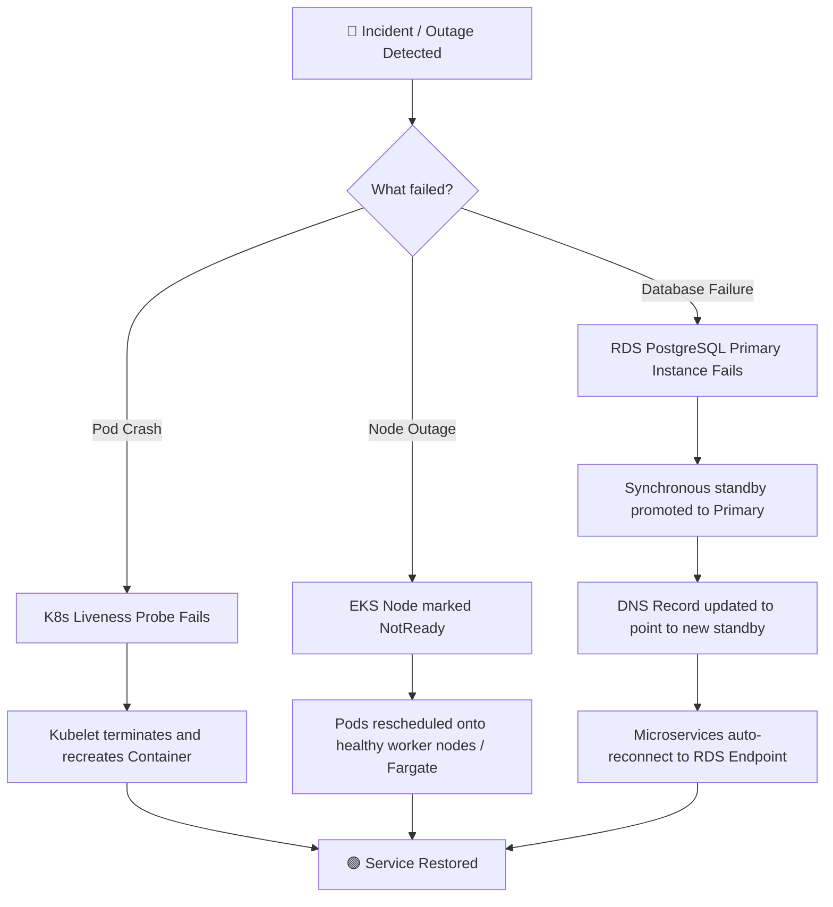

# 🛡️ CloudMart Disaster Recovery Plan

This document outlines the Disaster Recovery (DR) strategies, technical capabilities, and emergency response plans designed to guarantee business continuity and minimize data loss for the **CloudMart** microservices platform.

---

## 🎯 1. Recovery Objectives

Our recovery plans target two primary metrics:
* **Recovery Time Objective (RTO):** The maximum tolerable downtime for services before recovery.
* **Recovery Point Objective (RPO):** The maximum tolerable age of data that can be lost due to an incident.

| Metric | Target | Scope | Notes |
| :--- | :--- | :--- | :--- |
| **RTO (Service Recovery)** | **5 – 15 Minutes** | Standard Component Failures | Covers pod, node, or database instance failures. |
| **RTO (Region Disaster)** | **2 – 4 Hours** | Complete AWS Region Outage | Involves redeploying infrastructure to a backup region via IaC. |
| **RPO (Relational Data)** | **Near-Zero (Multi-AZ)** | Database Failures | RDS PostgreSQL synchronous replication keeps standby instances updated. |
| **RPO (Relational Backup)** | **Max 24 Hours** | Severe DB Corruption | Restored from the latest automated database snapshots. |
| **RPO (NoSQL Data)** | **Point-in-Time (PITR)** | DynamoDB Deletions | Restorable to any second in the past 35 days (production only). |
| **RPO (Asset Storage)** | **Zero Data Loss** | S3 Object Deletions | Enabled S3 Object Versioning safeguards all binary assets. |

---

## 🏗️ 2. Architectural Resilience & Automated Self-Healing

The CloudMart infrastructure is provisioned using Terraform to leverage native AWS and Kubernetes high-availability mechanisms.



### ☸️ Kubernetes Self-Healing & Deployment Policies
* **Liveness & Readiness Probes:** Kubernetes continuously checks pod health. Unhealthy pods are terminated and restarted automatically.
* **Rolling Updates:** Zero-downtime updates are enforced via the `RollingUpdate` strategy, maintaining service availability by rotating pods incrementally.
* **Replication & Pod Anti-Affinity:** Microservices run with multiple replicas across different Availability Zones to prevent single-point-of-failure (SPOF) disruptions.

### 💾 AWS Data Layer Resiliency
The database tier uses managed AWS services configured with robust durability rules:

* **RDS PostgreSQL (`db.t3.micro`):**
  * **Multi-AZ Availability:** Can be provisioned with a synchronous standby instance in a different Availability Zone (`rds_multi_az = true` in Terraform) for instant failover.
  * **Automated Storage Autoscaling:** The database scales its allocation dynamically up to a configured threshold (`max_allocated_storage = 20` GB) to prevent out-of-disk write failures.
  * **Deletion Protection:** Enabled in production (`deletion_protection = true`) to prevent accidental resource destruction via Terraform or AWS CLI.
  * **Automated Backups:** Daily snapshots are captured in a daily window (`03:00 - 04:00 AM`) and retained, with a final snapshot enforced before any voluntary deletion.
* **DynamoDB Product Table:**
  * **Point-in-Time Recovery (PITR):** Active in production (`point_in_time_recovery { enabled = true }`), allowing operations to roll back the database state to any specific second in the preceding 35 days.
* **Amazon S3 Asset Storage:**
  * **Object Versioning:** Versioning is enabled (`status = "Enabled"`), ensuring that file overwrites or deletions create a new version of the object instead of erasing it.
  * **Encrypted Backups:** Bounded by KMS Customer Managed Keys (`aws:kms` server-side encryption) to prevent raw data exposure during recovery actions.
* **SQS Message Queue Durability (`order_events`):**
  * **Message Durability:** Order events are kept in the queue for up to 14 days, protecting data from backend processing drops.
  * **Dead Letter Queue (DLQ):** Failed messages are routed to `order_events_dlq` after a specific count of failed processing attempts (`maxReceiveCount`), preventing poison messages from halting processing while saving transaction attempts.

---

## 📋 3. Failure Scenarios & Mitigation Procedures

> [!IMPORTANT]
> In any critical event, verify service status using AWS CloudWatch monitoring dashboards and Kubernetes status commands (`kubectl get pods -n production`).

### Scenario A: Application Pod or Container Failure
1. **Detection:** Kubernetes liveness probes fail; CloudWatch monitors show HTTP 5xx spikes.
2. **Auto-Mitigation:** Kubernetes terminates the pod and starts a new instance.
3. **Manual Verification:** 
   ```bash
   kubectl get pods -n production
   kubectl logs -n production deployment/<service-name> --tail=50
   ```

### Scenario B: EKS Worker Node or Fargate VM Outage
1. **Detection:** Pods show `Pending` or nodes status shows `NotReady`.
2. **Auto-Mitigation:** For Fargate deployments, AWS automatically provisions fresh container capacity. For EC2 Node Groups, EKS reschedules pods to alternative nodes in active AZs, and Cluster Autoscaler handles VM provisioning.
3. **Manual Verification:**
   ```bash
   kubectl get nodes -o wide
   kubectl get pods -n production -o wide
   ```

### Scenario C: PostgreSQL Database Primary Outage
1. **Detection:** Backend logs show database connection timeouts; RDS status shifts to `failing-over`.
2. **Auto-Mitigation:** AWS RDS automatically updates Route 53 CNAME routing to point to the Multi-AZ standby replica.
3. **Manual Verification:** Verify connectivity via the backend microservices.
   ```bash
   kubectl exec -it -n production deploy/user-service -- pg_isready -h <rds-endpoint> -p 5432
   ```

### Scenario D: Human Error / Accidental Deletions (Database or Files)
1. **Data Corruption:** Use AWS RDS Console to restore the database from a backup snapshot to a specific timestamp, or use DynamoDB PITR console.
2. **Accidental File Erasure:** Access the S3 storage bucket, locate the deleted object, and restore its previous version from the versioning tab.

---

## 🗺️ 4. Disaster Recovery Configuration Reference

> [!TIP]
> Ensure AWS Budgets are set up (`limit_amount = "100"`) to monitor unexpected cost spikes during disaster recovery exercises.

The parameters enforcing recovery features are located inside the Infrastructure-as-Code files:
* **RDS Config:** `CloudMart/infra/modules/rds/main.tf`
* **DynamoDB Config:** `CloudMart/infra/modules/dynamodb/main.tf`
* **S3 Versioning Config:** `CloudMart/infra/modules/s3/main.tf`
* **SQS DLQ Config:** `CloudMart/infra/modules/sqs/main.tf`

---

## 🗄️ 5. Kubernetes Manifest Backup Procedure

To protect against EKS cluster deletion or corruption, all running configurations should be exported to the Git repository.

### Exporting Kubernetes Resources
Run this command periodically or inside a scheduled cron task to capture all active configurations (Ingresses, Deployments, Services, ConfigMaps, Secrets, ExternalSecrets) from the `production` namespace:
```bash
# 1. Create a backup directory in your workspace
mkdir -p backups/k8s

# 2. Export namespace configurations to a single multi-resource YAML manifest
kubectl get all,ingress,secrets,configmaps,externalsecrets,secretstores -n production -o yaml > backups/k8s/production-manifests-backup.yaml

# 3. Commit and push the manifest backup back to Git
git add backups/k8s/production-manifests-backup.yaml
git commit -m "daily-backup: production k8s manifests"
git push origin main
```

---

## 🔄 6. RDS PostgreSQL Point-in-Time Recovery (PITR) Runbook

In the event of severe database corruption or human error, follow these steps to restore the database to a specific second in the past 7 days.

### Step-by-Step Restoration Procedure
1.  **Identify Target Time**: Determine the exact timestamp (in UTC) before the corruption occurred (e.g. `2026-06-09T10:15:00Z`).
2.  **Execute Restore Command**: Run the following AWS CLI command to restore the backup to a new database instance:
    ```bash
    aws rds restore-db-instance-to-point-in-time \
      --source-db-instance-identifier cloudmart-postgres-prod \
      --target-db-instance-identifier cloudmart-postgres-restored-prod \
      --restore-time 2026-06-09T10:15:00Z \
      --region ap-south-1
    ```
3.  **Monitor Restore Progress**:
    ```bash
    aws rds describe-db-instances \
      --db-instance-identifier cloudmart-postgres-restored-prod \
      --query "DBInstances[0].DBInstanceStatus" \
      --region ap-south-1
    ```
    *Wait until the output returns `"available"`.*
4.  **Verify Data**: Connect to the newly created endpoint (`cloudmart-postgres-restored-prod.xxxxxxxx.ap-south-1.rds.amazonaws.com`) and verify that the data integrity is restored.
5.  **Redirect Service Traffic**: Update the Helm `values-prod.yaml` file to set `cloudConfig.dbHost` to the new database endpoint, then redeploy:
    ```bash
    helm upgrade --install cloudmart ./helm-charts --namespace production -f ./helm-charts/values.yaml -f ./helm-charts/values-prod.yaml
    ```
6.  **Cleanup**: Once traffic is routed and verified, terminate the corrupt instance:
    ```bash
    aws rds delete-db-instance \
      --db-instance-identifier cloudmart-postgres-prod \
      --skip-final-snapshot \
      --region ap-south-1
    ```

---

## 🚀 7. RDS PostgreSQL Multi-AZ Automatic Failover Runbook

Our production database runs in **Multi-AZ** configuration (`rds_multi_az = true`), which replicates transactions synchronously to a standby instance in a different Availability Zone.

### Automatic Failover Simulation
To test the high-availability failover mechanism and ensure the application recovers automatically, simulate a primary database outage:

1.  **Verify Multi-AZ is Enabled**:
    ```bash
    aws rds describe-db-instances \
      --db-instance-identifier cloudmart-postgres-prod \
      --query "DBInstances[0].MultiAZ" \
      --region ap-south-1
    ```
    *Must output `true`.*
2.  **Trigger Reboot with Failover**: Force the primary database instance to shut down and fail over to the standby instance:
    ```bash
    aws rds reboot-db-instance \
      --db-instance-identifier cloudmart-postgres-prod \
      --force-failover \
      --region ap-south-1
    ```
3.  **Monitor Events**: Observe failover events using the CLI:
    ```bash
    aws rds describe-events \
      --source-identifier cloudmart-postgres-prod \
      --source-type db-instance \
      --duration 10 \
      --region ap-south-1
    ```
    *Look for events indicating:*
    *   `A Multi-AZ failover has started.`
    *   `Rebooting to promote standby.`
    *   `DB instance restarted.`
4.  **Verify Application Recovery**: During the failover window (typically 60-120 seconds), microservices will experience temporary connection drops. They should automatically reconnect as soon as the Route 53 DNS records point to the newly promoted standby instance. Check logs to confirm:
    ```bash
    kubectl logs -n production deployment/user-service --tail=20
    ```

---

## 🌐 8. DNS failover to Static S3 Website Runbook

If the primary Application Load Balancer fails or the EKS cluster is offline, Route 53 routes incoming requests to a static maintenance page hosted on S3.

### DNS Failover Architecture
*   **Primary DNS Record**: CNAME pointing to `app.cloudmart.example` -> ALB (Primary, evaluated by Route 53 health check).
*   **Secondary DNS Record**: CNAME pointing to `app.cloudmart.example` -> S3 Static Website Bucket Endpoint (Secondary, failover target).

### Demonstrating DNS Failover
To test and demonstrate this failover process:

1.  **Locate S3 Website Endpoint**: Find the public URL of the failover website:
    ```bash
    aws s3api get-bucket-website \
      --bucket failover-cloudmart-prod-team-axel \
      --region ap-south-1
    ```
2.  **Simulate ALB Failure**: Disable the ingress routing or simulate an EKS cluster failure by setting ingress target ports to an unreachable state (or temporarily delete the ingress resource):
    ```bash
    kubectl delete ingress frontend -n production
    ```
3.  **Observe Health Check Status**: In the AWS Route 53 Console, monitor the health check status for the ALB endpoint. It should transition from `Healthy` to `Unhealthy` within 90 seconds (3 consecutive failed interval checks of 30 seconds).
4.  **Verify Failover Page**: Open your web browser and navigate to:
    ```text
    http://app.cloudmart.example
    ```
    *The browser should display the **Maintenance Mode** static HTML error page served directly from the public S3 bucket.*
5.  **Restore Services**: Reapply the ingress resource to resume traffic flow to the pods:
    ```bash
    helm upgrade --install cloudmart ./helm-charts --namespace production -f ./helm-charts/values.yaml -f ./helm-charts/values-prod.yaml
    ```
    *Route 53 will detect the ALB endpoint is healthy again and switch DNS traffic back to the primary deployment.*