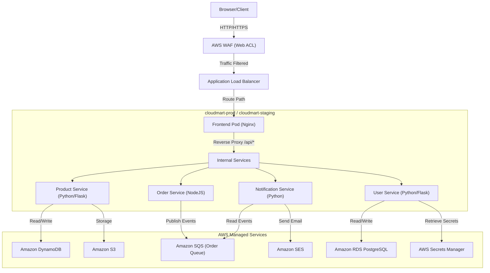

# CloudMart Security, Observability & Monitoring Guide

This guide details the DevSecOps architecture, implementation details, operational guidelines, and validation commands for the **CloudMart** microservices platform on AWS.

---

## 1. Current Architecture

The CloudMart microservices platform is deployed on **AWS** utilizing **Amazon Elastic Kubernetes Service (EKS)** with a serverless Fargate-first configuration to stay within low-cost / Free Tier limits.



---

## 2. Security Architecture

### IAM Roles & IRSA Mapping
We enforce the principle of least privilege using **IAM Roles for Service Accounts (IRSA)**. Wildcards are eliminated, and roles are mapped 1:1 with EKS Service Accounts via OIDC federation.

*   **`product-service-sa`** maps to `cloudmart-product-service-role-[env]`
    *   Permissions: Read/Write DynamoDB (`GetItem`, `PutItem`, `UpdateItem`, `DeleteItem`, `Query`, `Scan`), KMS decrypt key, S3 bucket access. No administration or wildcard permissions.
*   **`order-service-sa`** maps to `cloudmart-order-service-role-[env]`
    *   Permissions: SQS enqueue (`SendMessage`, `GetQueueAttributes`, `GetQueueUrl`, `ReceiveMessage`).
*   **`notification-service-sa`** maps to `cloudmart-notification-service-role-[env]`
    *   Permissions: SQS dequeue (`ReceiveMessage`, `DeleteMessage`, `GetQueueAttributes`, `GetQueueUrl`), SES email execution (`SendEmail`, `SendRawEmail`).
*   **`user-service-sa`** maps to `cloudmart-user-service-role-[env]`
    *   Permissions: Secrets Manager access strictly restricted to DB Credentials and JWT Sign keys (`secretsmanager:GetSecretValue`), KMS decrypt key.

### Network Policies (Default-Deny + Explicit Allow)
By default, Kubernetes allows open pod-to-pod communication. We enforce isolation in the `cloudmart-prod` / `cloudmart-staging` namespaces:
1.  **Default-Deny All**: Block all internal and external network ingress and egress.
2.  **DNS Egress**: Allow all pods to resolve hostnames via UDP/TCP Port 53 to CoreDNS in `kube-system`.
3.  **Frontend Ingress**: Only allow external ingress on port 80 (routed via ALB).
4.  **Frontend-to-Backend Egress/Ingress**: Allow the `frontend` pod to communicate with `product-service` (port 8001), `order-service` (port 8002), and `user-service` (port 8003).
5.  **Order-to-Product stock check**: Allow `order-service` to egress to `product-service` (port 8001).
6.  **External AWS Access**: Explicitly allow backend pods egress to external networks to reach AWS API endpoints.

### Pod Security Contexts
Every container in the Helm deployments has been hardened with:
```yaml
securityContext:
  allowPrivilegeEscalation: false
  capabilities:
    drop: ["ALL"]
  readOnlyRootFilesystem: true
```
We mount temporary `emptyDir` volumes at `/tmp` (and `/var/cache/nginx`, `/var/run`, `/var/log/nginx` for the frontend) to ensure Nginx, Flask, and NodeJS can handle required write operations without violating read-only root constraints.

### Secrets Injection (External Secrets Operator & CSI Driver)
We support two secure injection paths to avoid writing plain-text secrets to Git or K8s:
*   **External Secrets Operator (ESO)**: Automatically syncs secret values from AWS Secrets Manager to a Kubernetes Secret dynamically based on the namespace lifecycle.
*   **Secrets Store CSI Driver**: Dynamically mounts secrets as files into the pod volume using `SecretProviderClass` referencing Secrets Manager.

### WAF & GuardDuty Placement
*   **AWS WAF**: Bound directly to the ALB. It enforces the `AWSManagedRulesCommonRuleSet` (SQLi, XSS, etc.) and blocks common threats at the network edge before they hit EKS Fargate.
*   **AWS GuardDuty**: Continuously monitors EKS Audit Logs, VPC Flow Logs, and DNS queries, exporting high-severity findings directly to a security SNS notification topic.

---

## 3. Monitoring Architecture

### CloudWatch Metrics & Container Insights
*   **EKS Container Insights**: Enabled at the cluster level using the `aws-cloudwatch-observability` addon, streaming resource utilization (CPU, memory, storage, network) per pod to CloudWatch.
*   **RDS & DynamoDB Metrics**: Monitored natively via `AWS/RDS` and `AWS/DynamoDB` namespaces.
*   **SQS Queue Depth**: Tracked via `ApproximateNumberOfMessagesVisible` to monitor consumer lag.

### CloudMart custom Dashboard
We deploy the `CloudMart-Dashboard-[env]` featuring these critical widgets:
1.  **CPU & Memory Utilization**: Percentage utilized by the container workloads.
2.  **RDS Database Connection Count**: Tracks active postgres client connections.
3.  **SQS Queue Depth**: Active pending messages.
4.  **Custom EMF metric (Orders Processed)**: Real-time orders processed by `order-service`.
5.  **VPC Rejected Logs Insights**: Tracks blocked traffic sources and destination ports.

### Custom Metric EMF Publishing
In the Node `order-service`, successful order completion logs a structured JSON string in **AWS Embedded Metric Format (EMF)** directly to `stdout`. The CloudWatch agent automatically parses this stdout stream to ingest the metric:
```json
{
  "_aws": {
    "Timestamp": 1780000000000,
    "CloudWatchMetrics": [
      {
        "Namespace": "CloudMart",
        "Dimensions": [["Environment", "Service"]],
        "Metrics": [
          {
            "Name": "orders_processed_total",
            "Unit": "Count"
          }
        ]
      }
    ]
  },
  "Environment": "prod",
  "Service": "order-service",
  "orders_processed_total": 1
}
```

### Distributed Tracing (AWS X-Ray)
We deploy `aws-xray-daemon` sidecar containers within the `product` and `order` service pods. Both microservices are instrumented with the AWS X-Ray SDK:
*   **`order-service`**: Traces Express middleware and captures outbound HTTP (`axios`) and SQS client calls.
*   **`product-service`**: Traces Flask HTTP routes and captures boto3 calls to DynamoDB/S3.
*   Traces propagate downstream from the ALB ingress utilizing the `X-Amzn-Trace-Id` HTTP header.

---

## 4. Logging Architecture

*   **EKS Fargate Container Logging**: Since Fargate doesn't support DaemonSets, a native Fluent Bit sidecar is automatically attached by EKS.
*   **ConfigMap `aws-logging`**: Configured in the `aws-observability` namespace to tell EKS to route all stdout logs to CloudWatch.
*   **Log Groups**: Dedicated log groups are created per service (e.g. `/cloudmart/product-service-prod`).
*   **Retention**: Log groups are configured with a **7-day retention period** (cost-optimized for staging/production).

---

## 5. Alerting Architecture

We provision the following CloudWatch Alarms linked to the SNS Topic (`cloudmart-alerts-[env]`):
1.  **`product-service-high-error-rate`**: Triggers if the error rate exceeds 5% over 5 minutes (computed via metric math on Request vs Error count filters).
2.  **`sqs-queue-depth-high`**: Triggers if SQS messages exceed 100 for 5 minutes (alerts that `notification-service` is struggling).
3.  **`vpc-high-rejected-packets`**: Triggers if VPC Flow logs count more than 100 rejects in 1 minute.
4.  **`guardduty-high-findings`**: An EventBridge rule detects any GuardDuty finding with Severity >= 4 and sends an alert email to the operations team via SNS.

---

## 6. CI/CD Architecture

Our GitHub Actions pipeline (`deploy.yml`) is secured via the following policies:
*   **GitHub OIDC Authentication**: Long-lived AWS access keys are eliminated. GitHub Actions federates with AWS STS using OIDC token validation, assuming the IAM role dynamically.
*   **Image Security Scanning**: Trivy scanner executes in a separate dedicated security workflow (`security-scan.yml`), allowing scanning of container images in staging or production.
*   **SBOM Generation**: CycloneDX Software Bill of Materials (SBOM) are generated during the security scan and uploaded as a workflow run artifact (`sbom-*.json`).
*   **Environment Approval Gates**: Deployment jobs are bound to GitHub Environments (`staging` and `production`), enforcing manual approval rules for production.
*   **Dynamic WAF Association**: The pipeline dynamically queries WAF regional Web ACL ARNs using the AWS CLI and updates the Helm deployment override annotations automatically.

---

## 7. Terraform Architecture

The following Terraform resources support our Security & Observability stack:
*   **`aws_flow_log.main`**: Enables VPC flow logs.
*   **`aws_cloudwatch_log_group.vpc_flow_log`**: Log group destinations.
*   **`aws_cloudwatch_log_metric_filter.vpc_rejected`**: Filter to count rejected packets.
*   **`aws_cloudwatch_metric_alarm.vpc_rejected_alarm`**: Alert on rejected packet spikes.
*   **`aws_wafv2_web_acl.main`**: Provisions edge WAF protection.
*   **`aws_guardduty_detector.main`**: Initiates GuardDuty threat detection.
*   **`aws_cloudwatch_dashboard.main`**: Provisions the operations dashboard.
*   **`aws_cloudwatch_log_group.service_logs`**: Microservice log storage.
*   **`aws_cloudwatch_log_metric_filter.product_service_errors`**: Metric filter for application errors.
*   **`aws_cloudwatch_metric_alarm.product_service_high_error_rate`**: Alert on Flask error count.
*   **`aws_eks_access_entry.github_actions`**: Grants EKS access to GitHub Actions OIDC assumed role.

---

## 8. Helm Architecture

Our Helm configurations map variables dynamically to support security:
*   `values.yaml`: Exposes `global.xray.enabled` and `secretsStoreCSI.enabled` variables.
*   `values-[env].yaml`: Enforces specific values per environment:
    *   Adds `eks.amazonaws.com/role-arn` annotations to microservice service accounts.
    *   Specifies container image repositories and tags.
    *   Declares Ingress annotations for ALB mapping and Edge WAF Web ACL integration.
*   `deployment.yaml` templates: Conditionally configure container `securityContext`, `/tmp` volume mounts, and inject the `aws-xray-daemon` sidecar when enabled.

---

## 9. Security Controls Implemented
- [x] **NetworkPolicies**: Default-deny and explicit microservice interaction allowed.
- [x] **IAM Roles for Service Accounts (IRSA)**: Standardized, zero-wildcard policies for Flask/NodeJS pods.
- [x] **Secrets Management**: Secrets Manager integrated with External Secrets Operator.
- [x] **Container Hardening**: Non-root runtime user (`appuser` UID 1000 / `nginx` UID 101), read-only root filesystems, drop capabilities, and disabled privilege escalation.
- [x] **VPC Flow Logs**: Enabled for all interfaces, logging to CloudWatch.
- [x] **WAF & Threat Detection**: regional Edge WAF ACL and active GuardDuty detectors.
- [x] **OIDC CI/CD Federation**: Token-based login for GitHub Actions.

## 10. Monitoring Controls Implemented
- [x] **Container Insights**: CPU, Memory, Disk, and Network utilization at Pod granularity.
- [x] **AWS CloudWatch Dashboard**: Fully interactive operations dashboard containing metric math calculations and flow logs filter graphs.
- [x] **Custom Metric Ingestion**: order-service EMF integration without external API dependencies.

## 11. Observability Controls Implemented
- [x] **Distributed Tracing**: AWS X-Ray SDK integration inside `order-service` and `product-service` with active X-Ray daemon container sidecars.
- [x] **Structured Logging**: Fluent Bit log streaming with 7-day retention and error filters.
- [x] **Automated Alerting**: Spikes in queue depth, errors, and network rejects automatically alert via SNS email.

---

## 12. Deployment Instructions

To apply the security, logging, and metrics infrastructure:

### A. Deploy Infrastructure (Terraform)
1. Navigate to the target environment directory:
   ```bash
   cd CloudMart/infra/environments/prod
   ```
2. Initialize and apply the configurations:
   ```bash
   terraform init -reconfigure
   terraform plan -out=tfplan
   terraform apply tfplan
   ```

### B. Deploy EKS Logging & CSI Configuration
1. Apply the Fargate logging configuration:
   ```bash
   kubectl apply -f fargate-logging.yaml
   ```
2. Attach the logging policy to the Fargate pod execution role:
   ```bash
   aws iam attach-role-policy \
     --role-name <FARGATE_POD_EXECUTION_ROLE_NAME> \
     --policy-arn arn:aws:iam::aws:policy/CloudWatchAgentServerPolicy
   ```

### C. Deploy Application Workloads (CI/CD Pipeline)
1. Push your changes to the `main` branch.
2. In the **GitHub Actions** tab, trigger the **Manual Deployment Pipeline** for the target microservice, choosing `production` as the environment.

---

## 13. Validation Steps

### A. Verify Network Policies
Verify that pods only talk to permitted endpoints. Run:
```bash
# Connect to user-service pod
kubectl exec -it deployment/user-service -n cloudmart-prod -- sh

# Attempt to connect to product-service (Should be BLOCKED)
curl --connect-timeout 3 http://product-service:8001/health

# Connect to frontend pod
kubectl exec -it deployment/frontend -n cloudmart-prod -- sh

# Attempt to connect to user-service (Should SUCCEED)
curl --connect-timeout 3 http://user-service:8003/health
```

### B. Trigger CloudWatch Alarms
Simulate a high error rate to trigger the `product-service-high-error-rate` alarm:
1.  Run a script inside the cluster or curl the endpoint repeatedly with a bad request payload to output errors:
    ```bash
    curl -X POST http://<ALB_DNS_NAME>/api/products -d '{"invalid":"payload"}'
    ```
2.  Check the CloudWatch Alarm console to verify the status transitions from `OK` to `ALARM` and that an SNS email is sent.

### C. View GuardDuty Findings
You can trigger a test finding in GuardDuty using the CLI:
```bash
# Generate sample findings
aws guardduty create-sample-findings \
  --detector-id $(aws guardduty list-detectors --query "DetectorIds[0]" --output text) \
  --finding-types "UnauthorizedAccess:EC2/SSHBruteForce"
```
Verify the SNS alert email is sent for finding severity >= 4.

### D. Query VPC Flow Logs
Run a CloudWatch Logs Insights query to find rejected packets:
```sql
fields @timestamp, srcAddr, dstAddr, dstPort, protocol
| filter action = 'REJECT'
| stats count(*) by srcAddr, dstAddr, dstPort
| sort count(*) desc
| limit 20
```

---

## 14. Troubleshooting Guide

### 1. Pods Crash with `ReadOnlyFileSystem` errors
*   **Symptom**: NodeJS or Python pod fails to startup, log displays `ReadOnlyFileSystem` or `permission denied` write errors.
*   **Fix**: Identify the path where the service attempts to write (e.g. logging directories, session storage). Mount an `emptyDir` volume at that path inside `deployment.yaml`.

### 2. Fluent Bit is not shipping logs
*   **Symptom**: Pod logs are visible via `kubectl logs` but do not show up in CloudWatch logs.
*   **Fix**: Check if the Fargate pod execution role has `CloudWatchAgentServerPolicy` attached. Confirm the EKS logging namespace is exactly `aws-observability` and the ConfigMap `aws-logging` contains valid Fluent Bit syntax. Pods must be restarted after log configs are modified.

### 3. Missing AWS X-Ray Tracing Segments
*   **Symptom**: No trace graphs appear in X-Ray.
*   **Fix**: Ensure `global.xray.enabled` is `true` in Helm values, and that the pod has `xray-daemon` sidecar active. Check that the sidecar logs do not report AWS credential problems (it inherits the IRSA role of the pod).

---

## 15. Cost Impact Analysis

| Component | Cost Model | Estimated Monthly Cost (ap-south-1) |
| :--- | :--- | :--- |
| **AWS WAF** | $5.00 per Web ACL per month + $1.00 per rule + $0.60 per million requests | ~$6.00 (under 1 million requests) |
| **AWS GuardDuty** | Free for first 30 days, then $1.00 per GB of logs analyzed | ~$1.20 (based on 1.2 GB logs) |
| **CloudWatch Logs** | Ingestion: $0.50/GB, Storage: $0.03/GB/month | ~$0.80 (7-day retention limits storage cost) |
| **CloudWatch Metrics** | 3 Dashboard widgets are free. Alarms: $0.10 per alarm/month | ~$0.40 (4 alarms) |
| **AWS X-Ray** | Traces ingested: $5.00 per million traces (First 100,000 free) | $0.00 (within free tier) |
| **Total Estimated Cost** | DevSecOps Overhead | **~$8.40 / month** |

*Comparison with Open-Source Self-Hosted (e.g., Prometheus + Grafana + Falco + OPA)*:
Self-hosting these tools in Kubernetes requires running Prometheus, Grafana, Jaeger, and Falco agents. This requires at least **2 extra EC2 nodes** (t3.medium class, ~$30/month each) just to handle logging and monitoring cluster overhead. Using native serverless AWS options saves **~$50/month** and simplifies management.

---

## 16. Production Readiness Checklist
- [ ] Verify SSL certificate is bound to the ALB listener.
- [ ] Confirm all environment Secrets Manager variables are fully configured.
- [ ] Verify that production replica values in `values-prod.yaml` are set to at least 2.
- [ ] Confirm that RDS PostgreSQL deletion protection is enabled.
- [ ] Ensure SNS alert email is validated.

## 17. Security Checklist
- [x] Edge protected by WAF and rate-limiting.
- [x] In-cluster traffic isolated via NetworkPolicies.
- [x] IAM access role-scoped using IRSA (least privilege).
- [x] Disk resources encrypted via KMS Customer Managed Keys.
- [x] Long-lived CI/CD access keys replaced with OIDC STS AssumeRole.

## 18. Monitoring Checklist
- [x] Dashboard configured with CPU, Memory, RDS connections, and SQS messages metrics.
- [x] SQS queue depth alert operational.
- [x] HTTP 5xx error alerts active.
- [x] Custom EMF transaction metric displaying on dashboard.

## 19. Disaster Recovery Considerations

*   **Database Backups**: RDS automatically runs snapshots daily (retention configured in Terraform). If the database is deleted or corrupted, monitoring connection alarms will trigger. Restoring from backup can be completed using standard RDS snapshot recovery.
*   **State Detection**: Since ECR has immutable tags, in the event of EKS cluster failure, we can recreate the cluster via Terraform and instantly redeploy the exact docker image tags stored in `values-prod.yaml` to ensure zero code-level drift during recovery.
